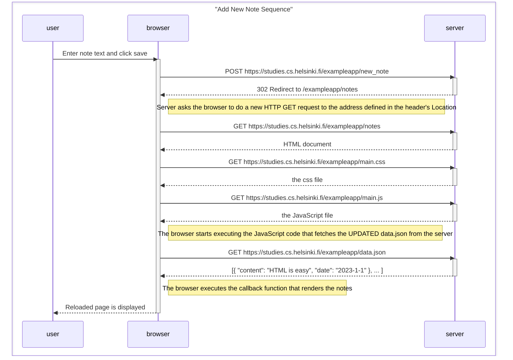

# Notes Page - New Note Sequence Diagram

```mermaid

sequenceDiagram
    box "Add New Note Sequence"
        participant user
        participant browser
        participant server
    end

    user->>browser: Enter note text and click save
    activate browser

    browser->>server: POST https://studies.cs.helsinki.fi/exampleapp/new_note
    activate server
    server-->>browser: 302 Redirect to /exampleapp/notes
    deactivate server

    Note right of browser: Server asks the browser to do a new HTTP GET request to the address defined in the header's Location

    browser->>server: GET https://studies.cs.helsinki.fi/exampleapp/notes
    activate server
    server-->>browser: HTML document
    deactivate server

    browser->>server: GET https://studies.cs.helsinki.fi/exampleapp/main.css
    activate server
    server-->>browser: the css file
    deactivate server

    browser->>server: GET https://studies.cs.helsinki.fi/exampleapp/main.js
    activate server
    server-->>browser: the JavaScript file
    deactivate server

    Note right of browser: The browser starts executing the JavaScript code that fetches the UPDATED data.json from the server

    browser->>server: GET https://studies.cs.helsinki.fi/exampleapp/data.json
    activate server
    server-->>browser: [{ "content": "HTML is easy", "date": "2023-1-1" }, ... ]
    deactivate server

    Note right of browser: The browser executes the callback function that renders the notes

    browser-->>user: Reloaded page is displayed
    deactivate browser
```