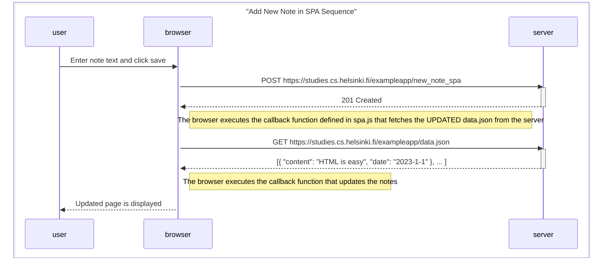

# Notes SPA - Loading Single Page App - Sequence Diagram

```mermaid

sequenceDiagram
    box "Add New Note in SPA Sequence"
        participant user
        participant browser
        participant server
    end

    user->>browser: Enter note text and click save
    activate browser

    browser->>server: POST https://studies.cs.helsinki.fi/exampleapp/new_note_spa
    activate server
    server-->>browser: 201 Created
    deactivate server

    Note right of browser: The browser executes the callback function defined in spa.js that fetches the UPDATED data.json from the server

    browser->>server: GET https://studies.cs.helsinki.fi/exampleapp/data.json
    activate server
    server-->>browser: [{ "content": "HTML is easy", "date": "2023-1-1" }, ... ]
    deactivate server

    Note right of browser: The browser executes the callback function that updates the notes

    browser-->>user: Updated page is displayed
```

